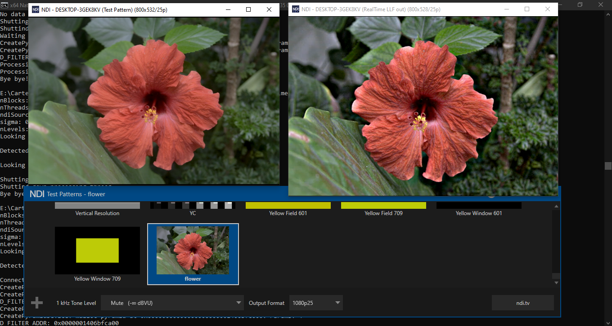

# Real Time LLF

An implementation of the Local Laplacian Filter made in plain C, OpenMP and CUDA that can be runned in real-time on a video stream thanks to [NDI](https://www.ndi.tv/).

The project also include an extra [c++ implementation](src/yoctoGl-c++) written with [yocto-gl](https://github.com/xelatihy/yocto-gl)

This project, as well the yocto-gl implementation, was written by Luca Sorace and Lorenzo P. for an university exam.



# Compile the project

The project has been written to be fully compatible on both Linux and Windows. It has been tested on Ubuntu 20.04LTS and Windows 10 21h2

## Linux

### Install the nvidia toolkit
First of all follow [this guide](https://docs.nvidia.com/cuda/cuda-installation-guide-linux) made by nvidia to install the CUDA toolkit. If you're on WSL, check [this other guide](https://docs.nvidia.com/cuda/wsl-user-guide) and be sure you're running on WSL2 using at least Windows 10 21h2. 21h1 will not work with cuda!

Once you're done installing the cuda toolkit, verify that nvcc is available by running `nvcc --version`. If it's not, check this [askbubuntu answer](https://askubuntu.com/a/885627) that _should_ fix this problem. Our nvcc version is 11.7.64

### Install NDI sdk
After you're done installing cuda, it's time to install the NDI sdk. Download the `software developer kit` (not the advanced one) from [here](https://www.ndi.tv/sdk/#download). Protip: you can enter random infos except your email addres, that's where you'll receive the download link. Download the linux's .tar.gz, extract it with `tar -xvf <archive name>` (I saved you a google search there :D), and run the .sh installer inside. It will uncompress the sdk inside the current folder. Now, I'm sure that's a better way to do this, but since I'm dumb I'm gonna tell you the way I made the headers and libs available at compile time: Open the sdk, copy the content of the `include/` folder inside `/usr/include/`, then copy the content of `lib/` to `/usr/lib/`. Pay attenction that of the lib files you've just copied, only one is a real file, the others are symlinks, so recreate them inside the `/usr/lib/` folder using `ln -s <real ndi lib file> <symbolic link name like in the original folder>`. Create an extra symlink inside `/usr/lib` called `libndi.so` using `ln -s <real ndi lib file> libndi.so`.

#### OPTIONAL: configure the ndi Discovery Servera
If you're under WSL, or if you're having troubles in detecting any NDI source, you should configure your NDI to use a Discovery Server on the current machine and on every machine that uses NDI in your LAN. On windows you have to download [NDI tools](https://www.ndi.tv/tools/#download-tools), install and run them, open `Access Manager` as admin from the NDI Launcher, go in the Advanced tab, Network Mapping, enable discovery servers and put the IP of the computer that's gonna run the discovery server. On linux, you have to download [Access Manager for linux](http://www.sienna-tv.com/ndi/accessmanager.html), extract the .zip, run the `NDI Access Manager` executable you can find inside the folder `Access_Manager` as the user that will also run the project (configurations are personal), open a web browser (even on another pc, if you're on an headless machine), visit `http://<IP OF THE COMPUTER WHERE YOU'VE JUST OPENED NDI ACCESS MANAGER>:9091`, put the IP of the computer that's gonna run the discovery server inside the `network->discovery servers` field and hit save settings. At this point you have to run the Discovery Server. (This procedure works for both windows and linux) Go in the folder where you've installed/extracted your NDI SDK and run `bin/<your platform>/ndi-discovery-service`. You need it running in the background when you're executing the project. Now you \*have\* to restart all of your ndi application in your lan to have them connect to the discovery server.

### Install Python3 with Pillow library
Our scripts are written in python3, so you have to install it! :D 
Grab it from your favourite package manaer (btw apt is the best), and then run `python3 -m pip install --upgrade Pillow` from your terminal

### Done
At this point everything should be setted up and you're ready to compile the project (just make sure you have g++ compiler installed, we worked on both g++ 9.4.0 and 11.1.0). CD into the root of the project and run one of the following targets: `make <all | clean | llf | openmp | cuda | realtime-ndi-llf | realtime-ndi-openmp | realtime-ndi-cuda>`. 

If you're running an ndi target, you may encounter problems in receive the video stream. This can be easily solved by instead running the project as root.

## Windows

### Install MSVC compiler and Visual Studio
First of all, you have to install the MSVC compiler. Download the [visual studio communnity installer](https://visualstudio.microsoft.com/it/downloads/) and install the whole `desktop development with c++` package (We're using visual studio 2019, but the 2022 version should be fine too). Once it's done, verify your installation by opening the `x64 Native Tools Command Prompt for VS` (you can search it in the windows search bar) and run `cl`. For instance, our cl version is 19.29.30146

### Install the nvidia toolkit
Now, install the nvidia toolkit following [this guide](https://docs.nvidia.com/cuda/cuda-installation-guide-microsoft-windows). Verify in any command prompt that nvcc (the cuda's compiler) is available, by typing `nvcc --version`. Our nvcc version is 11.7.64

### Intsall the ndi sdk
Time for ndi! Download the `software developer kit` (not the advanced one) from [here](https://www.ndi.tv/sdk/#download). Protip: you can enter random infos except your email addres, that's where you'll receive the download link. Download and install the SDK for windows. Open again the `x64 Native Tools Command Prompt for VS` and type `where cl`, you'll get the path where the msvc compiler is installed. It will look something like this: `D:\Visual Studio 2019\VC\Tools\MSVC\14.29.30133\bin\Hostx64\x64\cl.exe`. Now navigate in explorer to the folder up to `\bin\` (In our case it's `D:\Visual Studio 2019\VC\Tools\MSVC\14.29.30133\`) and in another explorer tab tpen the folder where you've installed the SDK. Copy the contents of `<ndi sdk path>\include\` to `<msvc path>\include\`. Open `<ndi sdk path>\lib\x64`, copy and paste in the same folder the lib file `Processing.NDI.Lib.x64.lib` and rename the new file to `ndi.lib`. Do the same in `<ndi sdk path>\lib\x86`. Then copy the contents of both `<ndi sdk path>\lib\x64` and `<ndi sdk path>\lib\x86` into respectively `<msvc path>\lib\x64` and `<msvc path>\lib\x86`. Then go into `<ndi sdk path>\bin\` and copy the contents of both `x64\` and `x86\` into `C:\Windows\System32\`. Yeah. I'm not joking. Feel free to ping me if you know a better method than this.

### Install Python3 with Pillow library
Our scripts are written in python3, so you have to install it! :D 
Grab it from [their website](https://www.python.org/downloads/release/python-3810/) and install it MAKING SURE you've enabled the option to add python to PATH. Once the installation is done, click also the option to remove the maximum char limit to PATH. Now, open a fresh windows of cmd and run `python3 -m pip install --upgrade Pillow`

### Install mingw-w64 to get "make"
The last step: install make. Download [mingw-w64](https://sourceforge.net/projects/mingw-w64/files/Multilib%20Toolchains%28Targetting%20Win32%20and%20Win64%29/ray_linn/gcc-10.x-with-ada/), extract it somewhere on your disk (EG inside `C:\mingw-w64\`), then on the windows search bar type `Path` and open `edit the environment variables for your account`. Under the `advanced` tab, click on `environment variables`. In the System variables (The bottom box) search for the variable called `Path`. Click on it and hit the edit button. Press new to add a new line, and write the path where you've extracted mingw-w64, followed by `bin\` (In our example, it would be: `C:\mingw-w64\bin\`). Press ok on everything and we're done!

### Done!
Open for the third and last time the `x64 Native Tools Command Prompt for VS` (repoen it if it was already on, it needs to refresh the PATH variable we just changed), CD into the root of the project and run one of the following targets: `make <all | clean | llf | openmp | cuda | realtime-ndi-llf | realtime-ndi-openmp | realtime-ndi-cuda>`. It should compile like a charm!

# Run the project

You can test the project in two different ways: by rendering a static image and by rendering a continous video stream in real time thanks to ndi

The best way on windows to run NDI is by installing the [NDI tools](https://www.ndi.tv/tools/#download-tools), and using test patterns or screen capture as source, and studio monitor to see the output of the project. On linux the easiest way is to install [OBS](https://obsproject.com/download#linux) and the [ndi obs plugin](https://github.com/Palakis/obs-ndi/releases/tag/4.9.1) (don't worry that it's some ndi versions behind, it's fine), and using the tools -> ndi output settings as source and NDI source to see the output of the project

## Static image

To compile the version that simply renders a static image and outputs the execution time, you just need to run `make llf` (for the single core version), `make openmp` (for the multithread version), `make cuda` (for the gpu version). The binaries will be placed under the `bin/` folder. Since they output the rendered image to stdout, the best way to run them is by using the script `scripts/testStaticImage.sh <llf | openmp | cuda>` or by commenting the `printStaticImage4(img4);` line in [src/llf/mainLlf.cpp](src/llf/mainLlf.cpp), or [src/OpenMP/openmpMain.cpp](src/OpenMP/openmpMain.cpp), or [src/CUDA/mainCuda.cpp](src/CUDA/mainCuda.cpp). You can change the static image it's going to render by editing the testimage of the [makefile in the project's root](makefile). If you want to edit the llf's parameters, you have to change the pars of the llf call in the previous main files.

The openmp and cuda executables take some extra parameters. In openmp you have to specify the number of threads, in cuda you have to specify the number of blocks and number of threads for each block. The "testStaticImage" script comes with some default parameters we used while testing (24 threads for openmp, 512 blocks and 256 threads for cuda), you have to edit `scripts/testStaticImage.sh` to change them

The output rendered image will be placed inside the `tmp/` directory

## Real time rendering with NDI

To compile the version that simply renders a static image and outputs the execution time, you just need to run `make real-rime-llf` (for the single core version), `make real-rime-openmp` (for the multithread version), `make real-rime-cuda` (for the gpu version). The binaries will be placed under the `bin/` folder. You can directly run them, however they take some argouments:
```
realtime-ndi-llf:    <ndi-source name> <sigma> <alpha> <beta> <nLevels>
realtime-ndi-openmp: <ndi-source name> <sigma> <alpha> <beta> <nLevels> <number of threads>
realtime-ndi-cuda:   <ndi-source name> <sigma> <alpha> <beta> <nLevels> <number of blocks> <number of threads per block>
```
If you want to just see the project working, some good params for the cuda version are: `"NDI SOURCE NAME HERE" 0.35 0.4 5.0 3 512 256`

If you don't know the name of your ndi source, you can specify an empty string (by literally writing `""`). The executable will output every coule seconds the list of sources it's able to find

To stop the program, you can just ctrl+c